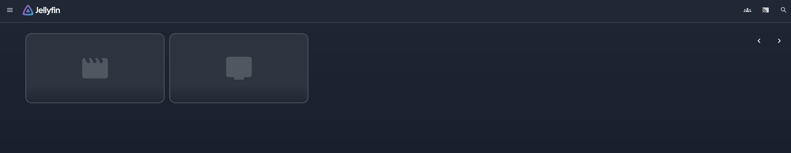
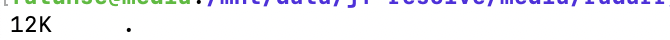

# jf-resolve: Bridging Real-Debrid and Jellyfin for Streamlined Media Consumption

`jf-resolve` acts as a crucial bridge between Real-Debrid and your Jellyfin media server. It integrates with Jellyfin, Jellyseerr, Radarr, Sonarr, and Prowlarr to automatically populate your media library with movies and TV shows.

**Key Feature:** `jf-resolve` does not store direct files locally on your machine. Instead, it connects to your Real-Debrid account and populates your Jellyfin library with streamable links from Real-Debrid. All requests made via Jellyseerr are automatically added to your library and are playable almost instantly, without requiring local downloads.

## Initial Library State (Before `jf-resolve`)

Here's what your media library tools might look like before `jf-resolve` is initialized:

### Jellyfin


### Radarr



### Sonarr


## In Progress
This is what it looks like when populating your library

### Jf-controller


### Radarr


### sonarr


### jellyfin

*Started at 10:24am and current screenshots taken at 10:40am. Metadata are not completely loaded yet

## Pros and Cons of using `jf-resolve`

### Pros
* **Reduced Wait Time:** Media items can be played almost immediately once they appear in Jellyfin.
* **Significant Space Savings:** Since you're streaming rather than storing files locally, your local storage footprint is dramatically reduced. For example, 14 movie requests via Jellyseerr resulted in a total library size of only 248KB.

### Cons
* **Subtitles Variability:** Subtitles may or may not work depending on the media source. Using an Open Subtitles plugin in Jellyfin might help resolve this.
* **On-the-fly Transcoding:** Media requiring transcoding will be transcoded each time it's played, as the file isn't hosted locally.
* **Limited Compatibility with Existing Arr Stacks:** It may not be fully compatible with an already extensively configured Radarr/Sonarr setup.
* **Duplicated Media:** In some cases, media is duplicated from having multiple media sources.

## Stack Used

`jf-resolve` is designed to work with the following applications:
* Jellyfin
* Jellyseerr
* Radarr
* Sonarr
* Prowlarr

**Note on Jellyseerr Aggression:** While you can set Jellyseerr's aggression to a high number, it's generally better to keep it low (below 5 if possible). High aggression can lead to scraping numerous unnecessary items. Manual requests made through Jellyseerr will still be processed as usual, and your library will grow organically over time.

## High-Level Overview of `jf-resolve`

The entire `jf-resolve` system is Python-based, requiring **Python, Pip, and Docker** for a successful setup. A **Real-Debrid subscription and API key** are also compulsory. The installer guides you through the necessary steps.

Here's how the system works:

1.  **Querying Media:** The `jf-resolve` controller calls your Jellyseerr backend to query for movies and TV shows, based on your configured aggression level.
2.  **Requesting Media:** Jellyseerr then sends these requests to either Radarr (for movies) or Sonarr/Prowlarr (for TV shows).
3.  **Torrent/Magnet Processing:** The torrent or magnet files are loaded.
4.  **Real-Debrid Integration:** The `jf-resolve` watchdog detects these files and makes a request to your Real-Debrid account using your API key.
5.  **Link Generation & Jellyfin Integration:** Real-Debrid generates a streamable link, which is then appended to a "dummy" streamable file and added to your Jellyfin library.
6.  **Link Refreshing:** The watchdog currently refreshes these Real-Debrid links. The current refresh interval is set to 30 days due to uncertainty about their actual expiration time.

* **Movie Sorting:** Movies are sorted into appropriate movie libraries.
* **TV Series Updates:** TV series are sorted and updated in conjunction with Sonarr when new episodes are added or existing ones are updated.
* **Quality:** The quality of your results will depend on the quality of your indexers. Media quality is also determined by your default resolution set in Jellyseerr. For instance, if you set 1080p as default, Jellyseerr will request 1080p media files. You can change this in Jellyseerr settings if file sizes become too large (e.g., some 1080p movies can be as large as 16GB). While transcoding is useful for local media to reduce file sizes, `jf-resolve` currently doesn't address this for streamed content.

**Customizing Jellyfin:** If you're not using Jellyfin themes but want to customize your web client, check out [ElegantFin](https://github.com/lscambo13/ElegantFin/releases) or [JellyfinMediaBar](https://github.com/MakD/Jellyfin-Media-Bar)

**Credits:**
All credit goes to the owners of the original projects and the teams behind Jellyfin, Jellyseerr, Radarr, Sonarr, and Prowlarr. Their work makes this possible. Special thanks also to Automation Avenue for their arr compose file, which was instrumental in setting up this project.

## Setup Guide

To set up `jf-resolve`, you have two options:

### Option 1: Using the Installer Script (Recommended)

1.  Clone or download the `jf-resolve` project.
2.  Navigate to the project folder in your terminal.
3.  Run `installer.py`. This script should automate most of the setup and start the controller.

### Option 2: Manual Setup

This option is not needed if you use `installer.py`.

1.  **Environment File Configuration:**
    * Open the `example.env` file.
    * Update the `PATH` variable to specify the desired directory where all media and container volumes will be mapped.
    * Rename `example.env` to `.env`.
2.  **Real-Debrid API Key:**
    * Go to Real-Debrid, obtain your API key, and paste it into the `REALDEBRID_API_KEY` line in your `.env` file.
3.  **Docker Compose Review:**
    * Review the `compose` file and modify it to your liking if necessary.
    * If no modifications are needed, run the following command to start your stack:
        ```bash
        docker compose up -d
        ```
4.  **Permissions (Linux/Mac Only):**
    * For Linux and Macs, the folders created by Docker Compose might be owned by the `root` user, preventing containers from accessing volume binds.
    * **Fix 1 (Recommended):** Manually create the folders as structured in your `.env` file *before* running `docker compose up -d`. This prevents Docker from recreating them with root ownership.
    * **Fix 2:** After the containers are up, you can run the `chown` command to change the owner from `root` to your user ID and group ID.
5.  **Configure Stack Tools:**
    * After bringing the containers up, configure each of your stack tools (Jellyfin, Jellyseerr, Radarr, Sonarr, Prowlarr) individually. Some instructions on how to do this can be found in the `instructions.txt` file within the project.
6.  **Jellyseerr API Key:**
    * After completing step 5, paste the API key for your Jellyseerr instance into the `JELLYSEERR_API_KEY` line in your `.env` file.
    * Save and close your `.env` file.
7.  **Configuration File:**
    * Open the `example.config.ini` file.
    * Configure it as desired, referring to the hints provided for each option.
    * Save the file as `config.ini` and close it.
8.  **Run Controller:**
    * In your terminal, run the following command:
        ```bash
        python controller.py --initiate
        ```
    * For Linux/Unix, you can add `nohup` before the command if you want it to run in the background (e.g., `nohup python controller.py --initiate &`).

**Troubleshooting:**
* If your media is not populated on Jellyfin, rescan your library within Jellyfin.
* To reduce server load and improve performance, consider adjusting or reducing quality profiles in Radarr and Sonarr. Very large files (e.g., 20GB remuxes) can lead to extended loading times. A helpful guide for setting up quality profiles can be found here: [Trashguides - Radarr Quality Profiles](https://trash-guides.info/Radarr/radarr-setup-quality-profiles/)

## Disclaimer

This project is intended for **educational purposes only**. It was developed to explore the programmatic playback of non-local media through Jellyfin, integrating a debrid service and the common "Arr" stack. While it was a fun experiment, it is provided as-is, and others are welcome to modify or use it for their own educational purposes.

`jf-resolve` was primarily designed for **Linux machines**. While it might work on other platforms (like Windows), compatibility is not guaranteed, and thorough testing for errors on other platforms has not been performed. Error fixes will be addressed as time permits.

## Updates
I will try to update this as much as I can and fix errors that users may have.
If time permits, I will try to write something from the ground up, with less moving parts, but thats in the distant future... maybe.